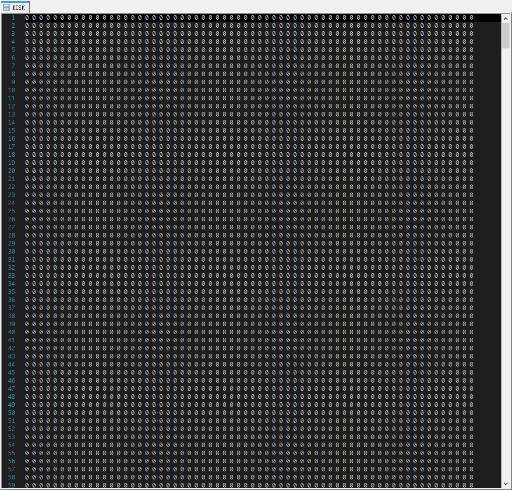
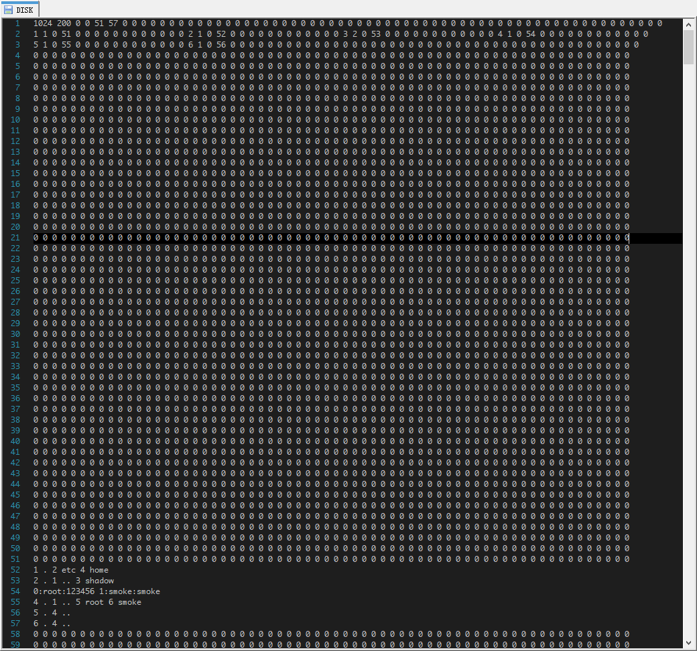
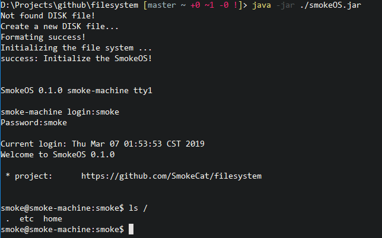

# filesystem

smokeOS：a simulation of linux file system

一个模拟文件系统的程序

## 运行程序

- 运行环境：JDK  11

```
C:\Users\Smoke> java -version
java version "11.0.1" 2018-10-16 LTS
Java(TM) SE Runtime Environment 18.9 (build 11.0.1+13-LTS)
Java HotSpot(TM) 64-Bit Server VM 18.9 (build 11.0.1+13-LTS, mixed mode)
```

- 克隆项目到本地

```
$ git clone git@github.com:SmokeCat/filesystem.git
```

- 命令行下进入项目根目录

```
$ cd filesystem
```

- 运行打包好的jar文件，重新运行前需要把生成的DISK文件删除

```
如果出现报错：java.lang.OutOfMemoryError:Java heap space，需要加上参数-Xmx3000m
$ java -jar ./smokeOS.jar
```

## 程序描述

创建一个DISK文件，用于模拟磁盘，并在此磁盘上实现一个简单的文件系统，并提供一个shell用于用户交互。

com.smoke.disk.Disk	：提供读写文件的接口，设定磁盘的规格，默认为1024行，即有1024个block，每个block可以写入64个字符

com.smoke.filesystem.FileSystem	：提供文件系统的接口，实现此文件系统的功能

com.smoke.filesystem.Shell	：提供用户与文件系统交互的功能

### 程序执行流程

- 开机

- 加载DISK磁盘文件

	- 若DISK文件已存在，读取DISK文件并装载文件系统（未实现）
	- DISK文件不存在，创建一个空白DISK文件并格式化，即写入1024行64个0
	
	

- 在格式化的DISK文件上初始化文件系统
	
	- 第1行存储superblock，记录磁盘block总数，inode总数，inode已使用数，数据块block已使用数，数据块block开始位置，控线数据块block位置
	- 第2行到第51行存储inode，每个block可以存储4个inode，即每个inode有16个字符
		
		- inode 第1到3个字符分别存储inode的id，flag（0为空inode，1为目录，2为文件），onwer id，剩余用来存储文件的block块号

	- 剩余都是存储数据的block
	
	

- 初始化文件系统后运行Shell，用户进行操作

	- 登录，认证用户身份

	- 提供命令行

	

- shutdown： 退出系统，关闭程序

### 用户指南

只是简单的实现了文件系统的逻辑，对用户操作不是很友好

- 创建目录
```
在当前目录下创建目录，不支持绝对地址
$ mkdir dirName
```

- 转换目录
```
切换到指定目录，参数必须为绝对地址
$ cd /path/dirName
```

- 删除目录
```
删除指定目录，会递归删除目录中所有子目录和文件
$ rmdir /path/dirName
```

- 创建文件
```
创建文件，有两个参数，为文件名和文件内容
$ createf fileName fileString
```

- 删除文件
```
删除当前目录下的文件
$ rmf fileName
```

- 打开，关闭文件（内部实现了更新文件内容的接口，没有实现编辑器，打开文件只是读取文件内容并输出在控制台上，关闭文件的功能还未实现）
```
文件使用绝对地址
$ openf /path/fileName
```

- 显示目录内容
```
显示指定目录的内容，使用绝对地址
$ ls /path/dirName
```

### 文件系统的工作

一切皆文件，文件结构为树结构，根目录为根节点

初始化文件系统生成了根目录，etc配置目录和home目录

etc目录中生成了一个shadow文件，用于记录系统用户的信息，包括用户id，用户名和用户密码，用于登录认证和权限认证，文件中包括root和smoke两个用户的信息

home目录中生成了root用户和smoke用户的家目录


#### 读取文件

- 获取根目录的inode，从根目录的文件指针获取根目录的内容，根目录中存储子文件的inode号

- 根据文件的路径获取目录中相应子目录的inode号，并获取子目录的内容

- 递归下去直到获取目标文件的inode

- 根据inode的owner id，判断当前用户是否有权限，没有权限则读取失败，拥有权限则根据inode文件指针从DISK文件中读取到文件内容，并输出到控制台中

#### 删除文件

- 获取当前目录inode，从当前目录内容中获取目标文件的inode号

- 如上判断是否拥有权限，没有权限则删除失败

- 根据目标文件的inode中的文件指针信息，将存储文件的block覆写（即写入“0 0 0 0 0 ……”）

- 将目标文件的inode的flag设置为0（空inode）并写入到DISK文件中

- 从当前目录的内容中将删除的文件的条目删除，将更新的当前目录写入到DISK文件中

#### 创建文件

- 从inode表中获取空inode（循环判断，返回flag==0的inode）

- 设置inode的id, flag(创建目录为1，文件为2), owner id

- 获取superblock中的空闲block指针，同时更新superblock的空闲block指针

- 向DISK文件中的指针位置写入文件内容，将指针更新到文件的inode中，若文件过大需要多个block，重复上一步和这一步，并依次将写入文件的位置更新到inode中

- 将文件的inode写入到DISK中

- 将文件的inode号和文件名添加到父目录的条目中，并更新到DISK文件中


### 未完成功能

文件系统的基本逻辑已经实现，时间和精力原因一些细节之处尚未实现，特此注释

- 读取已存在的DISK文件，挂载文件系统。目前每次运行前需要把DISK文件删除

- 用户命令的友好程度，比如同时对绝对路径和相对路径的支持

- superblock信息的更新，目前只实现了空闲指针的更新，其他内容的更新逻辑大致相同

- 文件编辑器

- 代码没有良好的设计和规范

- 等等